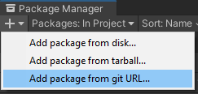
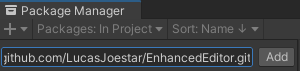

# Enhanced Editor

This repository is a wonderful toolbox that provide editor improvements and utilities for [Unity 3D](https://unity.com/).

## Getting Started

You can install this library from the *Package Manager*.

1. Open the *Package Manager* in your Unity project from *Window > Package Manager*.
2. Click on the icon *+* to add packages, and select *Add package from git URL...*



3. In the text field, enter the URL of this Git repository, and click on *Add*

```txt
https://github.com/LucasJoestar/EnhancedEditor.git
```



Unity will download the module and add it as a dependency.

### Updates

You check and download updated of the package by doing the same thing as the package installation (see the above section). After you click on *Add*, Unity will check for package changes, and install the new version if needed.

## Documentation

[=> Go to the full documentation!](./Documentation~/README.md)

## License

This project is under [license CC BY-NC-SA 4.0](https://creativecommons.org/licenses/by-nc-sa/4.0), which means:

- You are free to share the content: copy and redistribute it in any medium or format
- You can change anything from the original material, but you must distribute it under the same terms
- You must give appropriate credit, provide a link to the license and indicate if changes were made
- You can't use it as is for commercial purposes

License informations:

- [LICENSE.md](./LICENSE.md)
- [License CC BY-NC-SA 4.0 official document](https://creativecommons.org/licenses/by-nc-sa/4.0/legalcode)